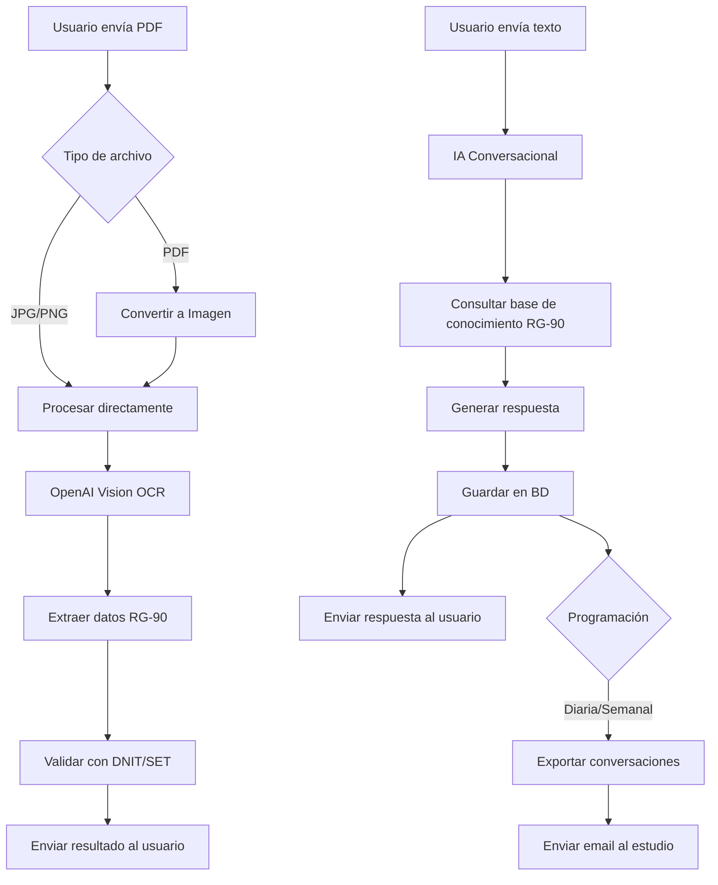

# 🤖 Funcionalidades del Bot de Telegram - Dataflow

## 📋 Tabla de Contenidos
1. [Procesamiento de Facturas](#procesamiento-de-facturas)
2. [Asistente Conversacional](#asistente-conversacional)
3. [Exportación de Conversaciones](#exportación-de-conversaciones)
4. [Configuración del Servidor](#configuración-del-servidor)

---

## 📄 Procesamiento de Facturas

### Formatos Aceptados
El bot ahora acepta **exclusivamente**:
- ✅ **PDF** - Se convierte automáticamente a imagen
- ✅ **JPG/JPEG** - Procesamiento directo
- ✅ **PNG** - Procesamiento directo

❌ **Todos los demás formatos son rechazados**

### Conversión Automática de PDF

Cuando envías un PDF:
1. El bot lo recibe y confirma
2. Convierte automáticamente la primera página a imagen JPG (300 DPI)
3. Procesa la imagen con OpenAI Vision
4. Extrae todos los datos fiscales
5. Valida contra la base de datos de la SET

**Requisitos del Servidor:**
- PHP extension `imagick` debe estar instalada
- Ghostscript debe estar disponible

### Instalación de Imagick (Producción)

```bash
# En Hostinger o servidor con cPanel
# Contacta soporte para instalar:
# - PHP Imagick extension
# - Ghostscript

# O si tienes acceso SSH:
sudo apt-get update
sudo apt-get install -y php-imagick ghostscript
sudo systemctl restart php-fpm
```

---

## 💬 Asistente Conversacional

### ¿Qué hace?

El bot ahora puede mantener **conversaciones inteligentes** sobre:
- 📚 Resolución General RG-90
- 📝 Normativas fiscales de Paraguay
- 🧾 Validación de comprobantes
- ❓ Consultas contables generales
- 💡 Buenas prácticas fiscales

### Ejemplos de Uso

**Usuario:** "¿Qué es el timbrado?"
**Bot:** "El timbrado es un número de 8 dígitos emitido por la SET (Subsecretaría de Estado de Tributación) que autoriza la impresión de comprobantes..."

**Usuario:** "¿Cómo sé si mi factura cumple con RG-90?"
**Bot:** "Para cumplir con RG-90, tu factura debe incluir: RUC con DV, timbrado vigente de 8 dígitos, número con formato 001-001-0000001..."

### Contexto de Conversación

- El bot **recuerda los últimos 10 mensajes**
- Puede mantener conversaciones coherentes
- Todas las conversaciones se **guardan en la base de datos**
- Puedes exportarlas por email al estudio

---

## 📧 Exportación de Conversaciones

### Comando Artisan

Exporta y envía por email todas las conversaciones:

```bash
php artisan telegram:export-conversations --email=contador@estudio.com
```

### Opciones Disponibles

```bash
# Exportar todas las conversaciones
php artisan telegram:export-conversations --email=contador@estudio.com

# Exportar solo un usuario específico
php artisan telegram:export-conversations --email=contador@estudio.com --user=5

# Exportar desde una fecha específica
php artisan telegram:export-conversations --email=contador@estudio.com --since=2025-12-01
```

### Contenido del Email

El email incluye:
- 📊 Número total de conversaciones
- 👤 Usuario y email de cada conversación
- 💬 Todos los mensajes con timestamps
- 🎨 Formato HTML profesional con colores diferenciados:
  - 🔵 Mensajes del usuario (fondo azul)
  - 🟢 Respuestas del asistente (fondo verde)

### Programar Envío Automático

Agrega a tu crontab:

```bash
# Enviar reporte diario a las 23:00
0 23 * * * cd /ruta/a/dataflow && php artisan telegram:export-conversations --email=contador@estudio.com --since=today >> /dev/null 2>&1

# Enviar reporte semanal los lunes a las 09:00
0 9 * * 1 cd /ruta/a/dataflow && php artisan telegram:export-conversations --email=contador@estudio.com --since="7 days ago" >> /dev/null 2>&1
```

---

## ⚙️ Configuración del Servidor

### 1. Instalar Imagick (para PDFs)

**Hostinger/cPanel:**
```bash
# Contacta soporte para activar:
- PHP Imagick extension
- Ghostscript
```

**VPS/Servidor Propio:**
```bash
sudo apt-get update
sudo apt-get install -y php8.2-imagick ghostscript
sudo systemctl restart php8.2-fpm
```

**Verificar instalación:**
```bash
php -m | grep imagick
# Debe mostrar: imagick
```

### 2. Ejecutar Migración

```bash
cd /home/u489458217/domains/dataflow.guaraniappstore.com/public_html
php artisan migrate --force
```

Esto crea la tabla `telegram_conversations` con:
- `user_id` - ID del usuario
- `chat_id` - ID del chat de Telegram
- `role` - 'user' o 'assistant'
- `message` - Texto del mensaje
- `timestamps` - Fecha y hora

### 3. Configurar Email (si aún no está)

En `.env`:
```env
MAIL_MAILER=smtp
MAIL_HOST=smtp.gmail.com
MAIL_PORT=587
MAIL_USERNAME=tu-email@gmail.com
MAIL_PASSWORD=tu-app-password
MAIL_ENCRYPTION=tls
MAIL_FROM_ADDRESS=tu-email@gmail.com
MAIL_FROM_NAME="Dataflow Bot"
```

### 4. Limpiar Caché

```bash
php artisan config:clear
php artisan cache:clear
php artisan view:clear
```

---

## 🧪 Pruebas

### 1. Enviar PDF al Bot
1. Abre Telegram
2. Busca tu bot
3. Envía un PDF de factura
4. Verifica que se procese correctamente

### 2. Probar Conversación
**Usuario:** "Hola, ¿qué es RG-90?"
**Bot:** (Respuesta inteligente sobre RG-90)

### 3. Exportar Conversaciones
```bash
php artisan telegram:export-conversations --email=tu-email@test.com
```

---

## 📊 Flujo Completo



---

## 🆘 Solución de Problemas

### Error: "Imagick extension no está instalada"
**Solución:** Instala php-imagick en el servidor (ver sección Configuración)

### Error: "No se pudo convertir el PDF"
**Causas posibles:**
- PDF protegido con contraseña
- PDF corrupto
- Falta Ghostscript en el servidor

**Solución:** Pide al usuario que envíe foto en lugar de PDF

### Email no se envía
**Verificar:**
1. Configuración SMTP en `.env`
2. Logs: `tail -f storage/logs/laravel.log`
3. Queue funcionando: `php artisan queue:work`

### Conversaciones no se guardan
**Verificar:**
1. Migración ejecutada: `php artisan migrate:status`
2. Tabla existe: Ver base de datos `telegram_conversations`
3. Logs de errores: `storage/logs/laravel.log`

---

## 📝 Changelog

### v2.0.0 (2025-12-11)
- ✅ Conversión automática de PDF a imagen
- ✅ Asistente conversacional con IA
- ✅ Guardado de conversaciones en BD
- ✅ Exportación y envío por email
- ✅ Validación estricta de tipos de archivo
- ✅ Prompt OCR mejorado para facturas paraguayas

---

## 📞 Soporte

Para problemas o consultas:
- 📧 Email: admin@guaraniappstore.com
- 💬 Telegram: @tu_usuario_soporte
